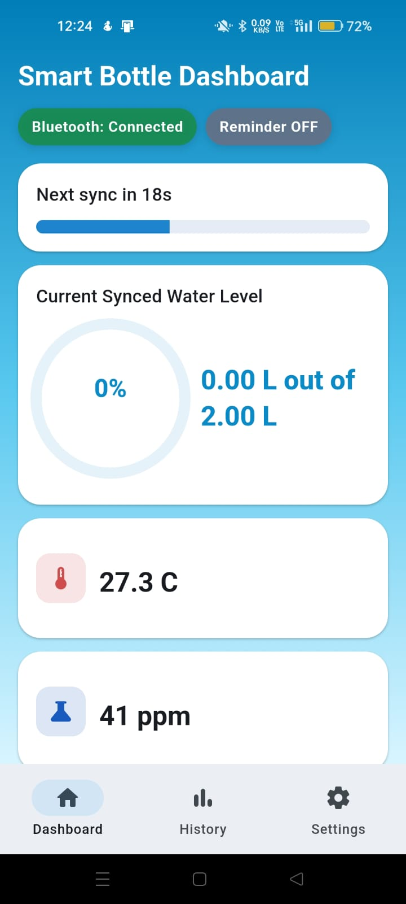
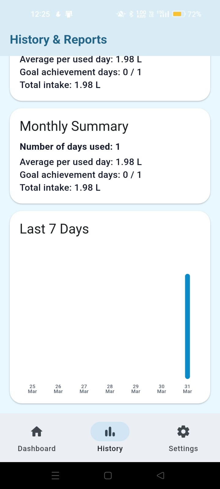
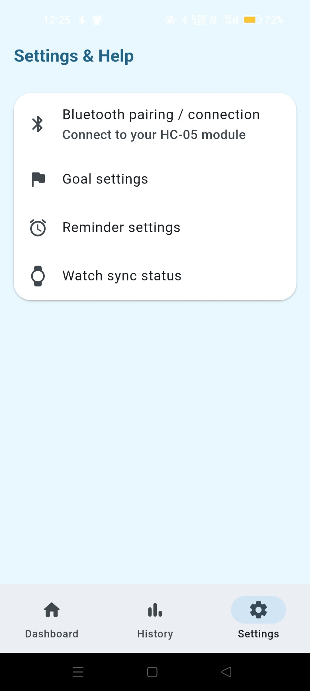
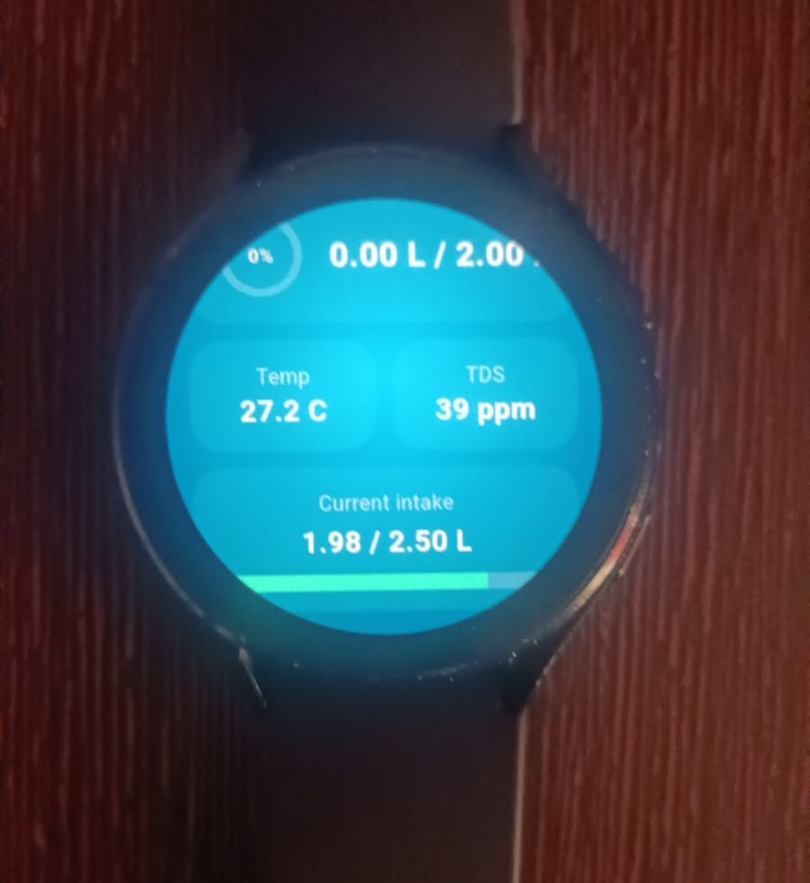
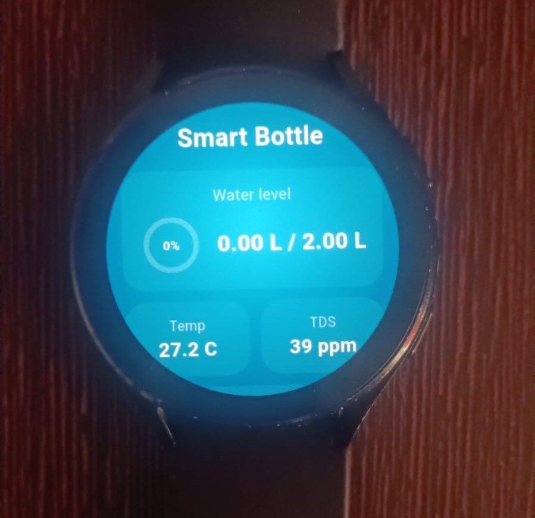

# Smart Bottle IoT Hydration Ecosystem

A comprehensive hydration tracking ecosystem featuring a Flutter-based mobile application, a companion Wear OS smartwatch application, and an Arduino-powered smart bottle. This project emphasizes real-time data processing, robust state management, and an intuitive cross-platform software experience to monitor and encourage healthy daily water intake.

## 📱 Mobile App Screenshots

### Dashboard


### History & Reports


### Settings & Help


## 📱 Mobile Application (Flutter)

The core of the software ecosystem is a cross-platform companion app built with Flutter, designed to process raw sensor telemetry and present actionable hydration insights.

- **Real-Time Data Pipeline**: Connects to the smart bottle via `flutter_bluetooth_serial`. It receives a continuous serial data stream and uses Regular Expressions to parse custom string formats (e.g., `Level: 65% | Temp: 26.4C | TDS: 230 ppm`) into usable state variables.
- **Anti-Lag Data Processing**: Solves the physical problem of water sloshing inside the bottle. The app maintains a 30-second rolling window of distance readings, computing the mode (or median) to filter out transient noise and provide a highly stable water level display on the UI.
- **Goal Tracking & Intake Analytics**: Continuously tracks water consumption by detecting decreases in bottle water level. It accumulates consumed amounts, compares them against user-defined daily goals, and generates historical summaries (daily, weekly, monthly).
- **Smart Hydration Reminders**: Monitors the rate of water level change over time. If the water level hasn't dropped by at least 5% within a user-configured interval, it triggers local push notifications via `flutter_local_notifications`.
- **Persistent Preferences**: Utilizes the `shared_preferences` package for local storage of user goals, reminder intervals, and application state.

## ⌚ Wear OS Companion App (Flutter)

A dedicated wearable application developed specifically for Wear OS devices (tested on the Galaxy Watch 4), bringing real-time hydration monitoring directly to the user's wrist.

- **Seamless Synchronization**: Acts as an intermediate bridge with the mobile application to sync real-time sensor metrics (water level, temperature, and TDS) without requiring a direct Bluetooth connection to the bottle.
- **Circular UI Optimization**: The user interface is custom-tailored for circular smartwatch displays, prioritizing a lightweight footprint and efficient performance on wearable hardware.
- **On-The-Wrist Notifications**: Seamlessly mirrors hydration alerts and progress updates, ensuring the user stays hydrated without needing to constantly check their phone.

## ⚙️ System Architecture & Working Principle

The software relies on a standard IoT sense-process-transmit architecture:
1. **Sensing & Hardware**: An Arduino Uno R3 interfaces with an ultrasonic sensor (water level via a 6-point piecewise linear calibration), a DS18B20 (temperature), and an analog TDS module (water quality).
2. **Transmission**: The Arduino packages these metrics into a formatted string and dispatches it via an HC-05 Bluetooth module at one-second intervals.
3. **Application Layer**: The mobile app consumes this stream, applies anti-lag smoothing algorithms, updates the reactive UI, and pushes the data up to the Wear OS application.

## 🛠 Tech Stack

- **Mobile & Wearable**: Flutter, Dart
- **Hardware/Firmware**: Arduino (C/C++)
- **Key Flutter Packages**: `flutter_bluetooth_serial`, `flutter_local_notifications`, `shared_preferences`

## 🗂 Repository Structure

```text
.
├── smart_bottle_phone/            # Flutter mobile application source code
├── smart_bottle_wear/             # Flutter Wear OS smartwatch application
├── firmware/
│   └── SmartBottle/               # Arduino C/C++ firmware source code
└── assets/                        # Project icons and UI assets
```

## 🚀 Getting Started

### Software Setup (Mobile & Watch)
1. Ensure the [Flutter SDK](https://flutter.dev/docs/get-started/install) is installed and configured on your machine.
2. Navigate to either `smart_bottle_phone/` or `smart_bottle_wear/`.
3. Run `flutter pub get` to fetch the necessary packages.
4. Run `flutter run` to deploy the mobile app to an Android/iOS device, or the wearable app to a Wear OS watch/emulator.

### Hardware Setup (Firmware)
1. Open `firmware/SmartBottle/SmartBottle.ino` using the Arduino IDE.
2. Install the `OneWire`, `DallasTemperature`, and `SoftwareSerial` libraries.
3. Connect the sensors (HC-SR04, DS18B20, TDS, HC-05) to the Arduino according to the pin mappings in the code, and flash the firmware.

## ⌚ Wear OS — Real Device

The companion Wear OS application was tested on a Galaxy Watch 4, providing real-time hydration data directly on the user's wrist.

### Smartwatch Dashboard


### Smartwatch Hydration Monitor



